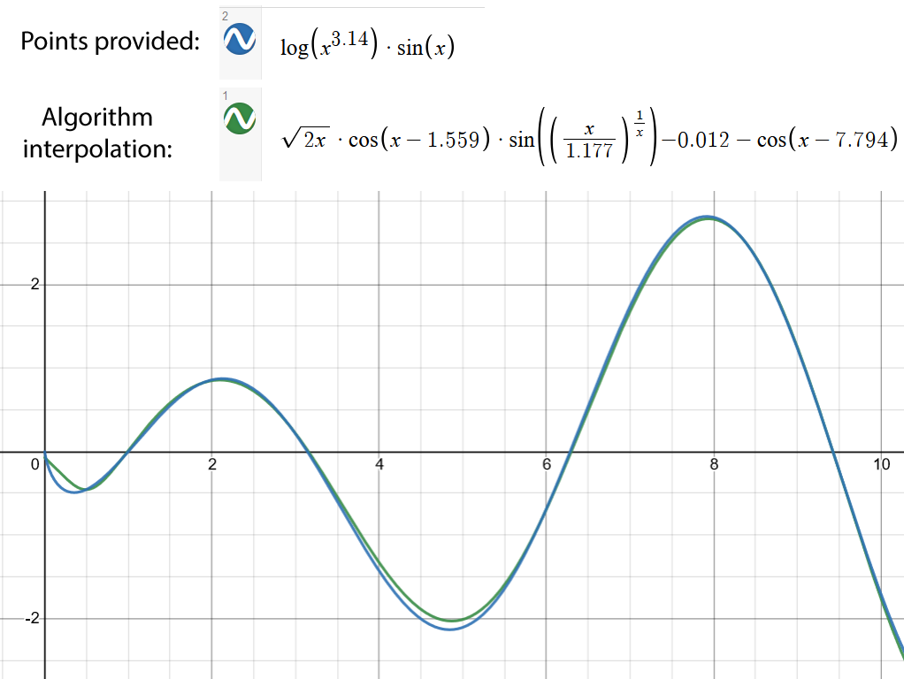

# EvolutiveInterpolation
This evolutionary algorithm uses two-dimension coordinates (encoded as 'X' and 'Y' arrays of double type values), to try and find a one variable arithmetic equation that interpolates them as closely as possible.

## Launching
The algorithm expects the following parameters:

`java -jar EvolutiveInterpolation.jar [pointListX] [pointListY] [errorMargin] [populationSize] [crossoverRate] [mutationRate] [lengthPenalty] [allowMultipleMutations] [maxTime]`

* **pointListX**: Array containing double values that represent the X coordinate. Must be the same lenght as *pointListY*. Syntax example: "[14, 14.15, 14.84, 15.01, 15.03]".
* **pointListY**: Array containing double values that represent the Y coordinate. Must be the same lenght as *pointListX*. Syntax example: "[9.0, 4.5, 2.01, 0, 2.01]".
* **errorMargin**: Double value that sets the error margin an equation has to determine it hits the provided points. Ex: "0.01". 
* **populationSize**: Integer value that sets the evolutionary algorithm's population size.
* **crossoverRate**: Double value in the [0-1] range that indicates how often population individuals reproduce between generations.
* **mutationRate**: Double value in the [0-1] range that indicates how often population individuals mutate between generations.
* **lengthPenalty**: Double value that allows equations to have a fitness penalty the longer they are, to encourage shorter expressions. Ex: "0.10" means a 10% fitness penalty for each increase on equation size. "0" sets no penalty.
* **allowMultipleMutations**: Boolean value encoded as integer (1 or 0) that sets wether an individual can undergo several consecutive mutations.
* **maxTime**: Maximum allowed execution time in seconds. If set to 0 no limit is imposed.